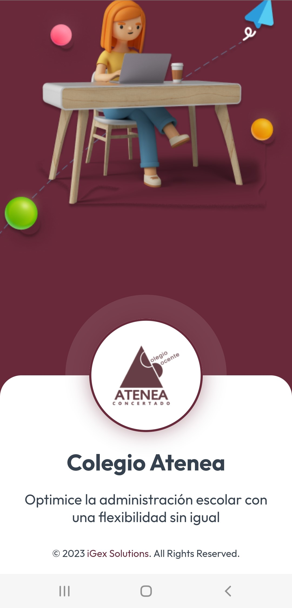
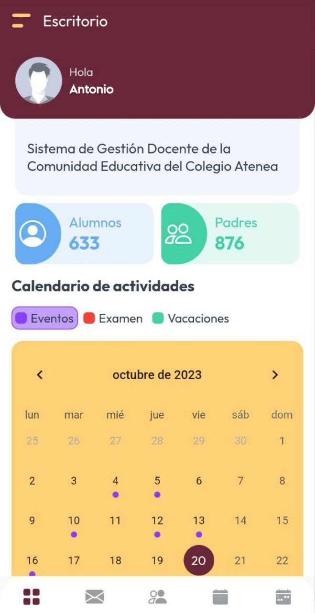
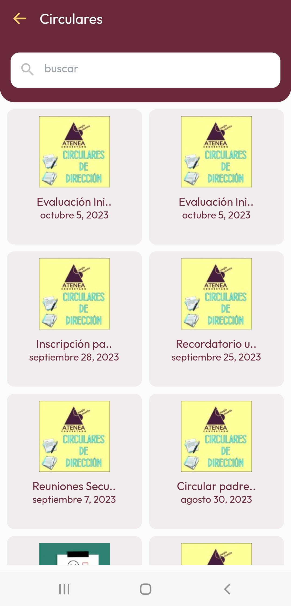
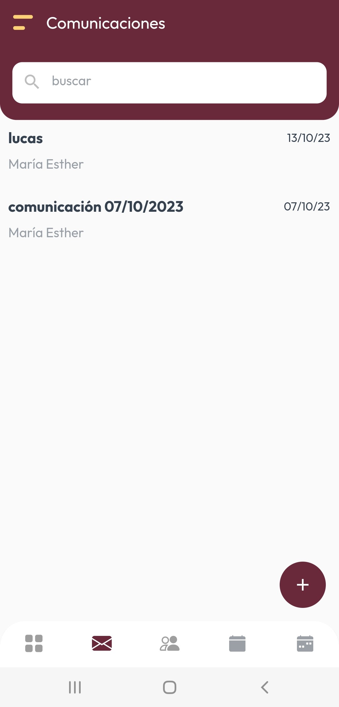
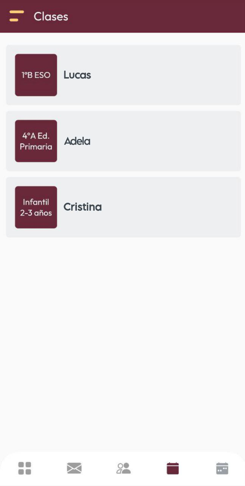
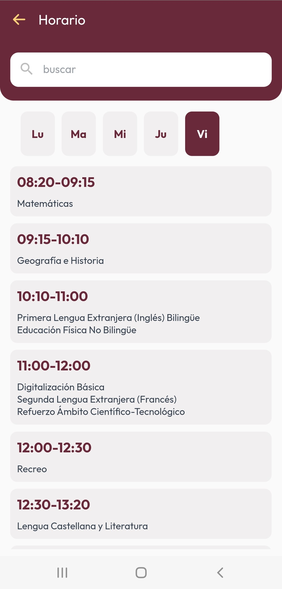
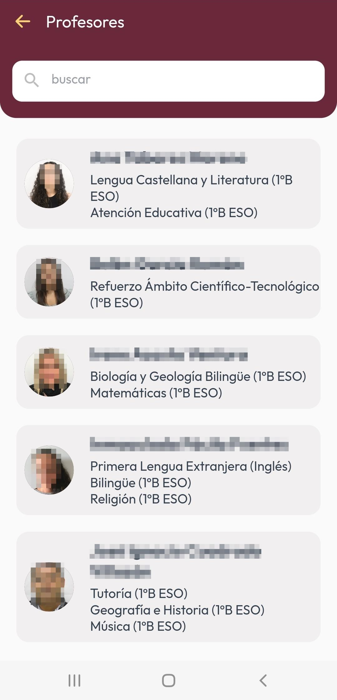

 
<h1>Colegio Atenea</h1>

<h2>App Links&nbsp:</h2>

<ol>
  <li>Android : <a href="https://play.google.com/store/apps/details?id=com.atenea.colegioatenea.colegia_atenea&pcampaignid=web_share" target="_self">Atenea App</a></li>
    <li>IOS : <a href="https://apps.apple.com/in/app/atenea-app/id6470358478****" target="_self">Atenea App</a></li>
</ol>

<table>
  <tr>
                <td><strong>For Students</strong></td>
                <td>
                    <ul>
                        <li>Access to real-time grades, assignments, and class schedules.</li>
                        <li>Notifications for important deadlines and upcoming events.</li>
                        <li>Ability to communicate directly with teachers and peers.</li>
                    </ul>
                </td>
            </tr>
            <tr>
                <td><strong>For Teachers</strong></td>
                <td>
                    <ul>
                        <li>Tools for managing class schedules, assignments, and grading.</li>
                        <li>Ability to send announcements, grades, and feedback directly to students and parents.</li>
                        <li>Direct messaging system for communication with students and parents.</li>
                    </ul>
                </td>
            </tr>
            <tr>
                <td><strong>For Parents</strong></td>
                <td>
                    <ul>
                        <li>Real-time access to their child’s academic performance, attendance, and schedules.</li>
                        <li>Notifications on student progress, school events, and activities.</li>
                        <li>Direct messaging system to stay connected with teachers and school staff.</li>
                    </ul>
                </td>
            </tr>
            <tr>
                <td><strong>For Assistants</strong></td>
                <td>
                    <ul>
                        <li>Administrative tools for managing student data, attendance, and event schedules.</li>
                        <li>Integration with the school’s communication channels to ensure smooth daily operations.</li>
                        <li>Capability to update announcements and ensure the proper functioning of app features.</li>
                    </ul>
                </td>
            </tr>

  
</table>

<table>
  <tr>
    <td></td>
    <td></td>
    <td></td>
  </tr>
  <tr>
    <td><strong>Splash Screen</strong></td>
    <td><strong>Dashboard</strong></td>
    <td><strong>Circulars(Parent Side)</strong></td>
  </tr>
</table>

<table>
  <tr>
    <td></td>
    <td></td>
    <td></td>
  </tr>
  <tr>
    <td><strong>Communications</strong></td>
    <td><strong>Classes</strong></td>
    <td><strong>Timetable</strong></td>
  </tr>
</table>

<table>
  <tr>
    <td></td>
  </tr>
  <tr>
    <td><strong>Prefessors</strong></td>
  </tr>
</table>

