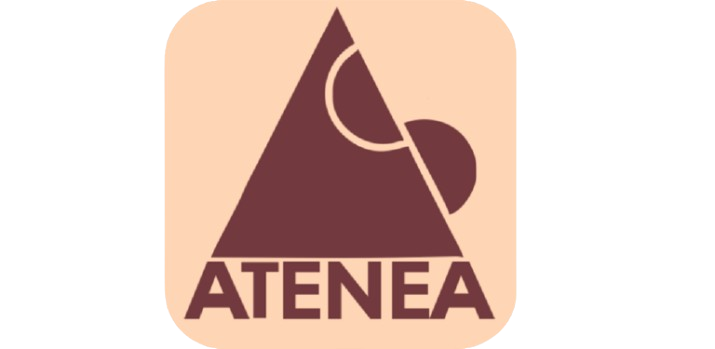

<h1>Colegio Atenea</h1>

<table>
  <thead>
    <tr>
      <th>Category</th>
      <th>Technology/Tools/Description</th>
    </tr>
  </thead>
  <tbody>
    <tr>
      <td>Framework</td>
      <td>Flutter</td>
    </tr>
    <tr>
      <td>Programming Language</td>
      <td>Dart</td>
    </tr>
    <tr>
      <td>Application Type</td>
      <td>Cross-Platform</td>
    </tr>
    <tr>
      <td>Push Notification</td>
      <td>Firebase Push Notifications</td>
    </tr>
    <tr>
      <td>Version Control</td>
      <td>GitLab</td>
    </tr>
    <tr>
      <td>IDE/Editor</td>
      <td>Android Studio, Xcode</td>
    </tr>
    <tr>
      <td>State Management</td>
      <td>Provider</td>
    </tr>
    <tr>
      <td>Localization</td>
      <td>Spanish (Primary), English</td>
    </tr>
  </tbody>
</table>

<h2>App Links&nbsp;:</h2>
<ol>
  <li>Android : <a href="https://play.google.com/store/apps/details?id=com.atenea.colegioatenea.colegia_atenea&pcampaignid=web_share" target="_self">Atenea App</a></li>
  <li>iOS : <a href="https://apps.apple.com/in/app/atenea-app/id6470358478" target="_self">Atenea App</a></li>
</ol>

<h2>App Description&nbsp;:</h2>
<table>
  <thead>
    <tr>
      <th>Role</th>
      <th>Features</th>
    </tr>
  </thead>
  <tbody>
    <tr>
      <td><strong>For Students</strong></td>
      <td>
        <ul>
          <li>Access to real-time grades, assignments, and class schedules.</li>
          <li>Notifications for important deadlines and upcoming events.</li>
          <li>Ability to communicate directly with teachers and peers.</li>
        </ul>
      </td>
    </tr>
    <tr>
      <td><strong>For Teachers</strong></td>
      <td>
        <ul>
          <li>Tools for managing class schedules, assignments, and grading.</li>
          <li>Ability to send announcements, grades, and feedback directly to students and parents.</li>
          <li>Direct messaging system for communication with students and parents.</li>
          <li>Manage Dining Attendance Feature of Students.</li>
        </ul>
      </td>
    </tr>
    <tr>
      <td><strong>For Parents</strong></td>
      <td>
        <ul>
          <li>Real-time access to their child’s academic performance, attendance, and schedules.</li>
          <li>Notifications on student progress, school events, and activities.</li>
          <li>Direct messaging system to stay connected with teachers and school staff.</li>
          <li>Dining Menu and Dining Status of Their Child.</li>
          <li>School Store Access from App: Order, Add to Cart, Order History Management.</li>
        </ul>
      </td>
    </tr>
    <tr>
      <td><strong>For Assistant</strong></td>
      <td>
        <ul>
          <li>Manage Preschoolers (Little Children).</li>
          <li>Send Report to Each Preschooler’s Parent, Common Notice for All Preschoolers’ Parents.</li>
        </ul>
      </td>
    </tr>
  </tbody>
</table>

<h2>App Screenshots&nbsp;:</h2>

<table>
  <tr>
    <td></td>
    <td></td>
    <td></td>
  </tr>
  <tr>
    <td><strong>Splash Screen</strong></td>
    <td><strong>Dashboard</strong></td>
    <td><strong>Circulars (Parent Side)</strong></td>
  </tr>
</table>

<table>
  <tr>
    <td></td>
    <td></td>
    <td></td>
  </tr>
  <tr>
    <td><strong>Communications</strong></td>
    <td><strong>Classes</strong></td>
    <td><strong>Timetable</strong></td>
  </tr>
</table>

<table>
  <tr>
    <td></td>
  </tr>
  <tr>
    <td><strong>Professors</strong></td>
  </tr>
</table>
