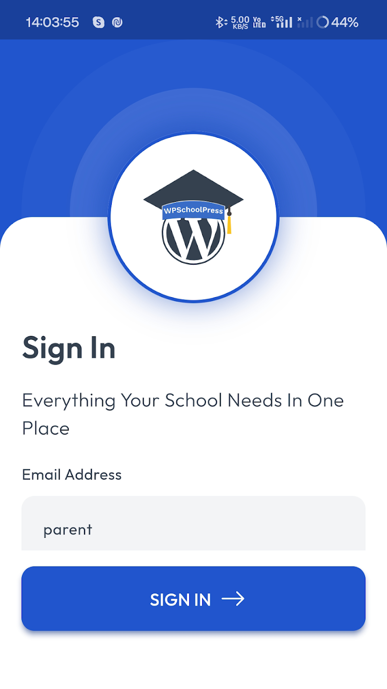
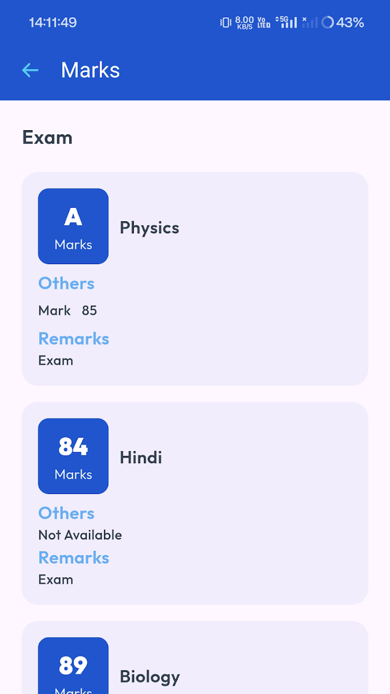
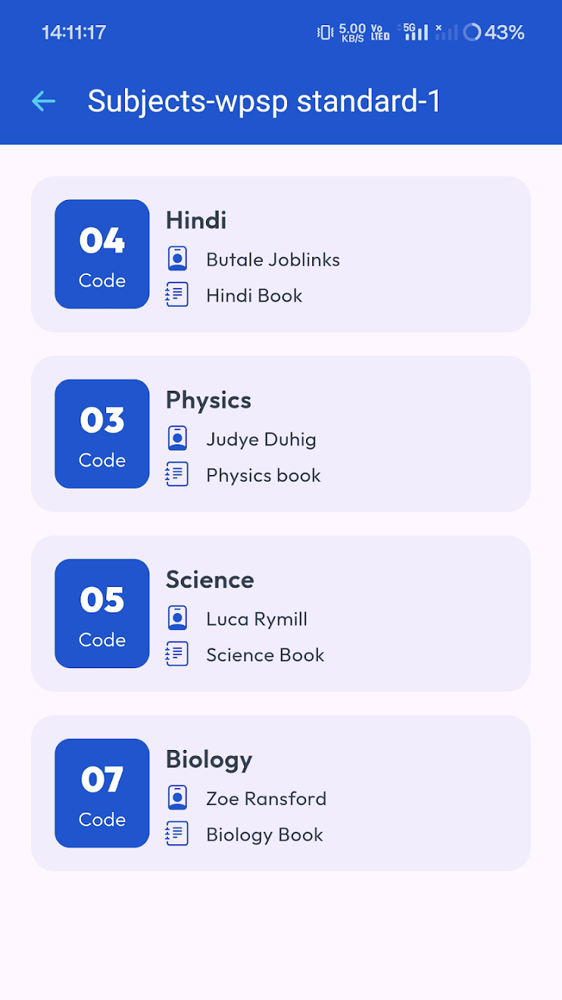
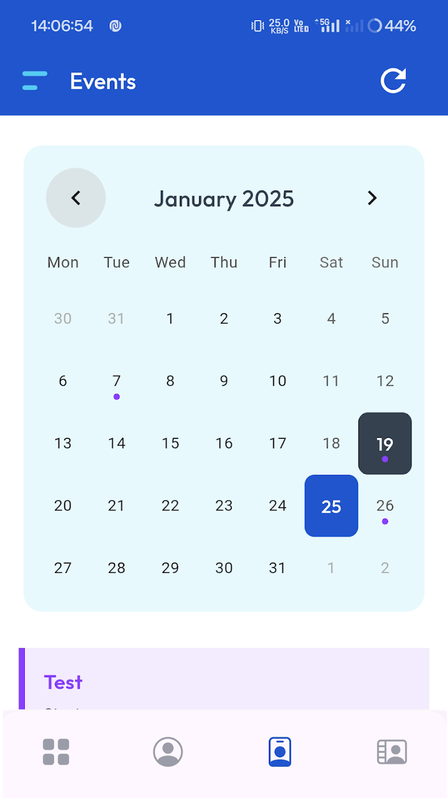

# 📱 WPSchoolPress Mobile App

A cross-platform mobile application built with **Flutter** that extends the powerful **WPSchoolPress** WordPress plugin to Android and iOS devices. This app brings school management functionality directly into the hands of **students** and **parents**—anytime, anywhere.

---

## 🚀 Overview

The **WPSchoolPress Mobile App** enhances school operations by offering real-time access to key features like attendance, grades, schedules, and communication tools. Built to sync seamlessly with the existing WordPress-based WPSchoolPress backend via REST APIs.

---

## 🔑 Key Features

- 👨‍🎓 **Student & Parent Dashboards**  
  Personalized interfaces for students and parents with access to relevant academic data.

- 📅 **Class Timetable**  
  View daily class routines and subject schedules.

- 📝 **Attendance Tracking**  
  Students and parents can track daily attendance status in real time.

- 🧾 **Exam Results & Grades**  
  Access to detailed performance reports, marks, and remarks.

- 🔔 **Push Notifications & Communication**  
  Receive important updates and messages via in-app notifications and Firebase alerts.

- 🧍‍♂️ **Student Profile Access**  
  View academic records, personal details, and class information.

---

## 🛠️ Tech Stack

| Category         | Technology                     |
|------------------|--------------------------------|
| Framework        | Flutter (Dart)                 |
| Backend API      | WordPress REST API (WPSchoolPress) |
| State Management | Provider                       |
| Platforms        | Android & iOS                  |

---

## 👨‍💻 My Role & Contributions

- 📲 Built the full mobile frontend using Flutter.
- 🔄 Integrated RESTful APIs for dynamic data sync with WordPress backend.
- 🎨 Designed responsive, adaptive UI for student and parent use cases.
- 🔒 Implemented secure authentication and session management.
- 🧪 Performed cross-device testing for performance and usability.

---

## 📦 Integration

This app requires the [WPSchoolPress WordPress Plugin](https://wpschoolpress.com/) to be installed on your school’s website. All data is synced through the plugin’s REST API.

---

## 📸 Screenshots

| 🏠 Login Screen                  | 📊 Dashboard                   | 🧾 Grades View                  |
|:-------------------------------:|:------------------------------:|:-------------------------------:|
|       |  |   |

| 📚 Subjects Overview             | 🧍‍♂️ Student Profile Details    | 📆 Events Page                 |
|:-------------------------------:|:------------------------------:|:-------------------------------:|
|  |  |   |

---

## 🌐 Live Demo / APK

Experience the app firsthand by downloading it from the Google Play Store:

👉 [Download WPSchoolPress Mobile App](https://play.google.com/store/apps/details?id=com.wpschoolpress.flutter_app&hl=en_IN)

---

